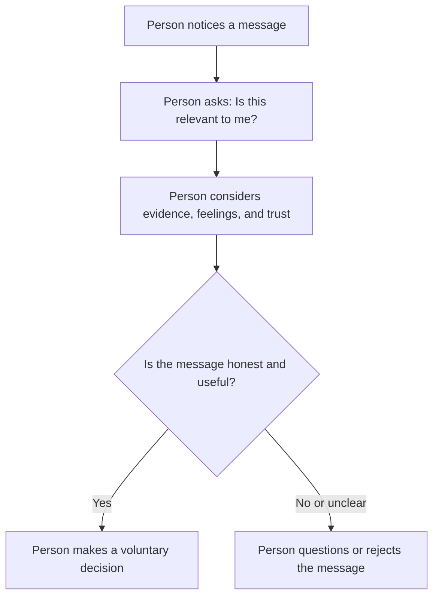

# Chapter 1: Persuasion and Human Decision-Making
## What Is Persuasion?

Persuasion is the ethical process of influencing how someone understands an idea or chooses to act. It helps shape attention, interpretation, trust, and action while still allowing people to make their own decisions.

For example, a plain white T-shirt can be described as comfortable, durable, or versatile. The shirt stays the same, but the message helps a customer focus on different benefits.

## Persuasion Is Not Manipulation

Persuasion uses honest information and respects a person's freedom to choose. Manipulation uses deception, hidden pressure, or misleading information. Coercion uses threats or force.

An ethical T-shirt brand might say, “This shirt is made from 100% cotton and is designed for everyday wear.” A manipulative brand might falsely say, “Only three shirts left!” to pressure a customer.

## Cialdini's Principles of Influence

Robert Cialdini identified several principles that explain why people may be influenced:

- **Reciprocity:** People often want to return a benefit they receive.
- **Commitment and consistency:** People often want their actions to match earlier choices and values.
- **Social proof:** People may look at what others are doing when they are uncertain.
- **Authority:** People tend to trust qualified experts and credible evidence.
- **Liking:** People are more open to people or brands they find relatable.
- **Scarcity:** People may value something more when it is genuinely limited.
- **Unity:** People can be influenced by a shared identity or sense of belonging.

| Principle | Mechanism | Ethical Use | Misuse Risk |
|---|---|---|---|
| Reciprocity | People want to return benefits | Offer a useful free sample with no pressure | Making people feel guilty to buy |
| Social proof | People look to others when uncertain | Share real reviews | Using fake reviews |
| Authority | People trust credible experts | Use qualified sources | Pretending to be an expert |
| Scarcity | Limited items can seem more valuable | State real limits honestly | Creating fake deadlines |

## Other Useful Ideas

### Framing

Framing means presenting the same information in a way that highlights a specific benefit. A plain white T-shirt can be framed as a low-cost basic, a versatile clothing item, or a durable wardrobe essential. Ethical framing does not hide important information.

### Loss Aversion

Loss aversion means people often want to avoid losses. A shopper may care about avoiding a T-shirt that shrinks after washing. An ethical message could say, “Pre-shrunk cotton helps the shirt keep its fit.”

### Ethos, Pathos, and Logos

- **Ethos** means credibility and trust.
- **Pathos** means emotion.
- **Logos** means facts, logic, and evidence.

A T-shirt company can use logos by explaining its material, ethos by being honest, and pathos by describing the comfort and confidence of wearing it.

## A Simple Decision Journey

## Questions to Ask Before Trying to Persuade

- Is my information accurate and honest?
- Does the audience have a real choice?
- Am I helping people understand a real benefit?
- Could this message mislead or pressure someone?
- Are claims about popularity, scarcity, or quality supported by evidence?
- Would I be comfortable explaining this strategy openly?

## Explore Further

Search for:

- Robert Cialdini principles of influence
- ethical persuasion versus manipulation
- framing effect psychology
- loss aversion behavioral economics
- ethos pathos logos examples

## What You Should Remember

Persuasion is an ethical way to shape attention, interpretation, trust, and action. It differs from manipulation because it uses honest information and respects choice. The same plain white T-shirt can be framed in different ways without changing the product. Good persuasion helps people make informed decisions instead of pressuring them.
