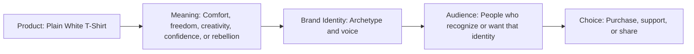

# Chapter 2: Brand Archetypes and Meaning

A brand is more than a logo, name, color, or product. Brands also communicate an identity and a feeling. Brand archetypes are one useful framework for understanding how a brand can make its products feel recognizable and meaningful.

For example, a plain white T-shirt is physically simple. However, the same shirt can feel adventurous, creative, luxurious, comforting, rebellious, or dependable depending on how it is presented. The product may not change, but its meaning can.

## What Are Brand Archetypes?

Brand archetypes are generalized cultural and storytelling patterns that help people quickly understand what a brand represents. They are based on familiar roles and themes that appear in stories, communities, and everyday life.

An archetype can help a brand answer questions such as:

- What kind of relationship does this brand want with its audience?
- What feeling should customers connect with this product?
- What does the customer get to imagine, feel, or become by choosing this brand?
- What values does the brand communicate?

For example, an Explorer brand may make customers feel independent and adventurous. A Caregiver brand may make customers feel supported and safe. A Creator brand may make customers feel imaginative and original.

## Common Brand Archetypes

| Archetype | Main Idea | What the Audience May Feel | Example Positioning for a Plain White T-Shirt |
|---|---|---|---|
| Explorer | Freedom, discovery, independence | Adventurous and capable | “A durable white T-shirt for wherever your next day takes you.” |
| Sage | Knowledge, truth, understanding | Informed and thoughtful | “A carefully made essential with clear material and care information.” |
| Creator | Imagination, originality, self-expression | Creative and unique | “A blank white canvas for your own style and ideas.” |
| Ruler | Control, status, excellence | Confident and successful | “A refined white essential designed for a polished wardrobe.” |
| Caregiver | Support, protection, service | Comfortable and cared for | “A soft, dependable shirt made for everyday comfort.” |
| Rebel | Change, independence, breaking rules | Bold and defiant | “A simple shirt for people who do not need loud labels to stand out.” |
| Hero | Courage, achievement, improvement | Strong and motivated | “A reliable basic built to keep up with your hardest days.” |
| Everyperson | Belonging, simplicity, connection | Included and relatable | “A comfortable white T-shirt made for everyday people and everyday life.” |
| Innocent | Simplicity, optimism, safety | Calm and hopeful | “A clean, simple white T-shirt with nothing extra to worry about.” |
| Jester | Fun, humor, play | Lighthearted and entertained | “A white T-shirt that proves basics do not have to be boring.” |
| Lover | Connection, beauty, pleasure | Attractive and appreciated | “A soft white T-shirt designed to feel as good as it looks.” |
| Magician | Transformation, possibility, wonder | Inspired and empowered | “One simple white T-shirt that can transform an entire outfit.” |

## The Same Product Can Mean Different Things

The plain white T-shirt stays physically the same, but its meaning changes depending on the archetype used.

### Explorer T-Shirt

An Explorer version could be described as:

> “A lightweight white T-shirt for spontaneous weekends, new places, and everyday freedom.”

This message makes the customer imagine movement, independence, and adventure.

### Creator T-Shirt

A Creator version could be described as:

> “A blank white canvas for your sketches, patches, layers, and personal style.”

This message makes the customer feel expressive and original. The shirt becomes part of a creative project.

### Caregiver T-Shirt

A Caregiver version could be described as:

> “A soft, dependable white T-shirt designed for comfort through busy days.”

This message focuses on reliability, care, and feeling supported.

### Rebel T-Shirt

A Rebel version could be described as:

> “No giant logo. No unnecessary noise. Just a white T-shirt for doing things your own way.”

This message presents simplicity as independence and resistance to pressure.

The shirt itself has not changed. What changes is the story around it and the identity the customer can connect to.

## Product, Meaning, Identity, and Audience

A brand does not simply sell an object. It offers a possible meaning for the object. Customers may choose a product partly because it helps them express who they are, who they want to become, or what they value.

## Archetypes Are Not Destiny

Archetypes are helpful models, but they are not literal personality diagnoses. A person is more complex than one category, and a brand can also have more than one tendency.

For example, a clothing brand might mainly use the Creator archetype while also using some Explorer ideas. It may encourage self-expression while also celebrating freedom and experimentation.

Cultural context matters too. A message that feels adventurous, funny, luxurious, or comforting in one community may be understood differently in another. Brands should listen to their real audience instead of assuming that everyone interprets symbols in exactly the same way.

Archetypes should guide thinking, not limit it. They are tools for creating clearer meaning, not rules that force every person or product into a fixed box.

## Questions to Ask When Choosing an Archetype

- What does the audience get to feel, imagine, or become by choosing this brand?
- Does this archetype fit the product honestly?
- Does the brand's tone match its actual behavior and values?
- Could the brand use more than one archetype without becoming confusing?
- Does the message respect different cultures, experiences, and identities?
- Is the archetype helping people understand the product, or only creating empty hype?
- Would customers still trust the brand if they saw how the message was designed?

## Concrete Example: One Shirt, Three Meanings

Imagine three advertisements for the same plain white T-shirt:

| Archetype | Message | Customer Experience |
|---|---|---|
| Explorer | “Pack less. Go farther. This lightweight white T-shirt is ready for the next place.” | The customer imagines freedom and adventure. |
| Creator | “Your outfit starts here. A clean white canvas for your own style.” | The customer imagines originality and self-expression. |
| Ruler | “The white essential for a sharp, controlled, polished look.” | The customer imagines confidence and status. |

Each advertisement describes the same physical item. The important difference is the meaning attached to it.

## What You Should Remember

Brand archetypes are practical storytelling patterns that give products, organizations, and experiences recognizable meaning. They help answer the question: “What does the audience get to feel, imagine, or become by choosing this brand?”

Archetypes such as Explorer, Sage, Creator, Ruler, Caregiver, Rebel, Hero, Everyperson, Innocent, Jester, Lover, and Magician can help a brand communicate clearly. However, archetypes are not rigid personality labels. A brand and its audience can contain many different tendencies, and cultural context always matters.

The plain white T-shirt example shows that the exact same product can feel adventurous, creative, comforting, rebellious, or polished depending on the story and identity connected to it.
