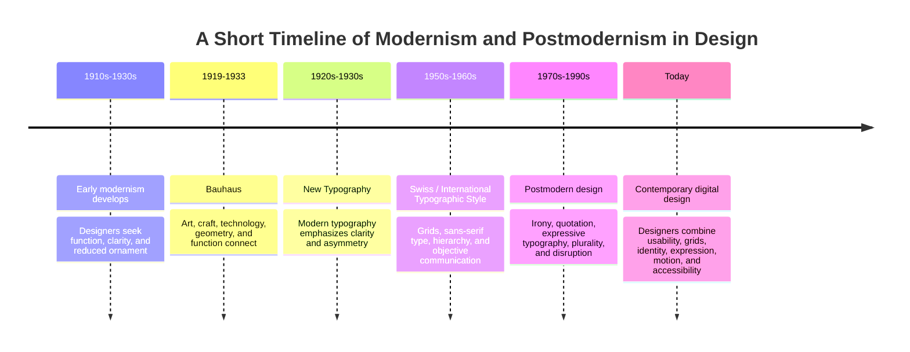

# Chapter 3: Modernism, Postmodernism, and Visual Language

Visual design communicates ideas before a person reads every word. Layout, typefaces, color, spacing, images, and organization all affect what something feels like. A design can feel serious, playful, trustworthy, expensive, simple, rebellious, confusing, or welcoming.

Design history helps explain why different visual choices carry different meanings. Modernism focused on clarity, order, function, and reduction. Postmodernism reacted against the idea that one orderly and universal style was always best. It made more room for identity, irony, expressive typography, quotation, and visual disruption.

These approaches are not only historical. Designers still make choices between order and disruption, clarity and expression, or restraint and abundance when they create websites, apps, advertisements, and product packaging.

## A Short Path Into Modernism

Modernism developed during the early twentieth century, when designers, artists, architects, and manufacturers were responding to industrialization, new technology, cities, and mass communication.

Many modernist designers wanted to move away from excessive decoration and historical imitation. They believed design should communicate clearly and work well for modern life. Rather than adding ornament just because it looked fancy, modernists often asked what a design needed to do.

Modernist design often values:

- Clear communication
- Simple forms
- Functional choices
- Logical structure
- Reduction of unnecessary decoration
- Readable typography
- Visual order

Modernism did not mean that every design looked exactly the same. However, it encouraged designers to use visual decisions carefully and purposefully.

## Bauhaus

The Bauhaus was a German school of art and design founded in 1919 by Walter Gropius. It brought together art, craft, technology, architecture, typography, furniture, textiles, and product design.

Bauhaus designers explored how design could work with modern materials and mass production. They often used geometry, primary colors, clean lines, simple forms, and functional materials. The school encouraged the idea that form and function should work together.

In graphic design and typography, Bauhaus ideas often supported:

- Sans-serif typefaces
- Geometric forms
- Strong contrast
- Clear layouts
- Simplicity
- Function over decoration

A Bauhaus-inspired poster may use circles, squares, straight lines, bold color, and simple type. The goal is not to make a design empty. The goal is to make every element feel purposeful.

## Swiss and International Typographic Style

Swiss Style, also called the International Typographic Style, developed mainly in Switzerland during the mid-twentieth century. It built on earlier modernist ideas, including Bauhaus and New Typography.

Swiss Style became known for clear communication and highly organized layouts. Designers often used a grid system to align text and images. Grids help create consistency, balance, and visual order.

Common features include:

- Grid-based layouts
- Sans-serif typefaces
- Asymmetrical composition
- Clear hierarchy
- Photography instead of decorative illustration
- Large areas of open space
- Objective and readable communication

A grid is like an invisible structure behind a page or screen. It helps designers decide where headlines, paragraphs, buttons, images, and other elements should go.

Swiss Style can make information feel dependable, direct, and organized. It is especially useful when a design needs to communicate clearly to many different people.

## Modernist Principles

Modernism is often connected to several important design principles.

| Principle | Meaning | Example in Design |
|---|---|---|
| Grid | An underlying structure that organizes content | A website aligns headings, text, and images into consistent columns. |
| Hierarchy | Making the most important information easiest to notice first | A large headline is seen before smaller supporting text. |
| Clarity | Making information easy to understand | A sign uses readable type and simple directions. |
| Reduction | Removing unnecessary elements | A product page uses only essential text, images, and buttons. |
| Function | Designing based on what something needs to do | A checkout button is clear, visible, and easy to use. |
| Universality | Trying to communicate clearly across many audiences | An airport sign uses simple symbols and direct language. |

## Postmodernism: A Reaction to Certainty and Order

Postmodern design developed partly as a reaction against the certainty, restraint, universality, and order associated with modernism.

Postmodern designers questioned whether one clean, universal visual language could represent everyone. They often embraced diversity, local identity, historical references, humor, contradiction, and complexity.

Postmodern design may use:

- Expressive or unusual typography
- Layered images and text
- Bright or unexpected color combinations
- Visual references to earlier styles
- Irony and humor
- Intentional disruption
- Decorative abundance
- Layouts that challenge or break a grid

Postmodern design is not simply “messy design.” It can use disruption on purpose. A designer may break a rule to create energy, question an assumption, or communicate a more personal identity.

## Modernism and Postmodernism Compared

| Design Tension | Modernist Tendency | Postmodern Tendency | Contemporary Digital Example |
|---|---|---|---|
| Order and disruption | Organized, stable layout | Fragmented or surprising layout | A banking app uses order; a music-event website may use animated disruption. |
| Universality and identity | Broadly understandable system | Specific voice, culture, or personality | A public-service site may use universal icons; an independent brand may use local references. |
| Clarity and expression | Readability and directness | Emotion, personality, and visual experimentation | A school website may prioritize clarity; a fashion site may use dramatic type. |
| Grid and anti-grid | Strict alignment and consistent spacing | Overlap, rotation, layering, or intentional imbalance | A checkout page uses a grid; an art portfolio may break it. |
| Restraint and abundance | Minimal elements and open space | Many textures, colors, references, or visual details | A productivity app may be minimal; a game site may be visually abundant. |
| Function and irony | Design supports a direct task | Design may comment, joke, or surprise | A transit app gives directions; a campaign page may use humor to make a point. |

## How the Tension Appears Today

Modernism and postmodernism did not disappear. They continue to influence contemporary web and product design.

A healthcare website, banking app, university portal, or government form usually needs clarity. It may use grid systems, readable text, obvious buttons, and consistent spacing. These are modernist strengths because people need to find information and complete tasks easily.

A fashion brand, music festival, artist portfolio, or entertainment campaign may choose expressive type, motion, bright color, collage, or visual surprise. These choices can create an emotional experience and make the brand feel distinctive.

The best design is not automatically the most minimal or the most expressive. It depends on the audience, purpose, content, accessibility needs, and setting.

For example, a medication-ordering screen should not hide important instructions behind an artistic layout. However, a concert poster can use expressive typography because emotional energy may be part of the message.

## How to Read a Design

When you see a poster, website, app, package, or advertisement, look beyond whether you personally like it. Ask what the design is trying to communicate.

Use these questions:

- What do I notice first?
- What information is most important?
- Is there a visible grid or alignment system?
- Is the typography calm, neutral, expressive, playful, serious, or difficult to read?
- Does the design use lots of empty space or lots of visual material?
- Does the design feel orderly or disruptive?
- Who seems to be the intended audience?
- Does the design prioritize function, expression, or both?
- Does the design make the product or organization feel trustworthy, exciting, luxurious, rebellious, simple, or something else?
- Are any choices making the design harder to use or understand?

## The Plain White T-Shirt

The same plain white T-shirt can feel like different products depending on its visual presentation.

### A Modernist T-Shirt Presentation

A modernist presentation could use:

- A white background
- A carefully aligned product photo
- Black sans-serif type
- A simple grid
- Clear product information
- Lots of open space

The message might say:

> Essential White T-Shirt  
> 100% cotton. Regular fit. Clear sizing. Everyday function.

This presentation makes the shirt feel practical, clean, dependable, and thoughtfully designed.

### A Postmodern T-Shirt Presentation

A postmodern presentation could use:

- Layered text and images
- Bright colors
- Different type styles
- A tilted or overlapping product photo
- Handwritten marks, collage, or visual jokes
- A playful or ironic slogan

The message might say:

> WHITE T-SHIRT.  
> NOT BORING.  
> WEAR IT WRONG. WEAR IT YOUR WAY.

This presentation makes the exact same shirt feel expressive, playful, individual, and culturally aware.

The shirt has not changed. The visual language changes what the audience imagines the shirt means.

## A Visual Design Timeline

## Museum Research

When researching design history, use museum and institutional collections instead of relying only on social media posts or random image searches. Museums and archives often provide object records, designer names, dates, materials, exhibition information, and historical context.

Look in collections from institutions such as:

- The Metropolitan Museum of Art
- The Museum of Modern Art (MoMA)
- Cooper Hewitt, Smithsonian Design Museum
- Victoria and Albert Museum (V&A)
- Bauhaus archives and museums
- Letterform Archive
- Museum für Gestaltung Zürich

Do not assume that every image online is correctly labeled. Verify the object, designer, date, and collection record yourself.

Useful search terms include:

- Bauhaus poster typography museum collection
- Herbert Bayer design collection
- Bauhaus textiles museum collection
- Swiss Style poster museum collection
- International Typographic Style graphic design collection
- Josef Müller-Brockmann poster collection
- postmodern graphic design museum collection
- Memphis design museum collection
- experimental typography institutional collection

When you find an object, take notes on:

- The designer or maker
- The title of the work
- The date
- The materials or medium
- The institution holding the object
- Which modernist or postmodernist characteristics you can identify

## What You Should Remember

Visual design carries ideas through structure, typography, color, images, spacing, and style. Modernism emphasized function, grids, hierarchy, clarity, reduction, and order. Bauhaus connected art, craft, technology, and function, while Swiss / International Typographic Style made organized systems and readable communication especially important.

Postmodernism challenged the belief that one universal, restrained style could fit every situation. It introduced more plurality, irony, quotation, expressive typography, identity, and disruption.

Contemporary designers still work with these tensions: order and disruption, universality and identity, clarity and expression, grid and anti-grid, restraint and abundance, and function and irony. The plain white T-shirt can feel practical and dependable in a modernist presentation or playful and expressive in a postmodern presentation, even though the physical product stays the same.
